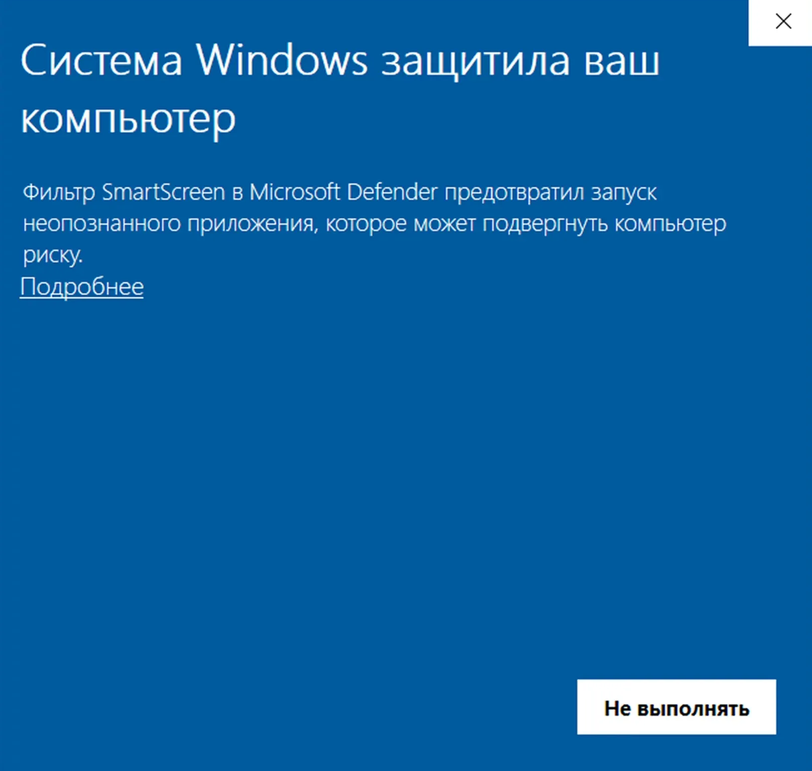
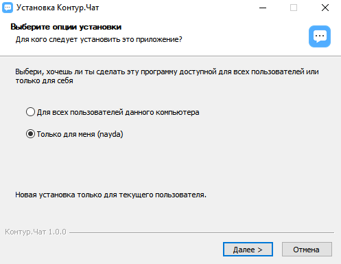
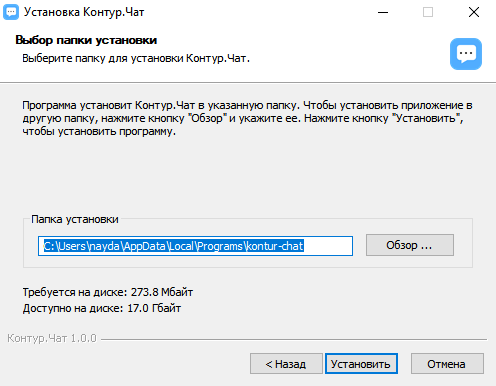
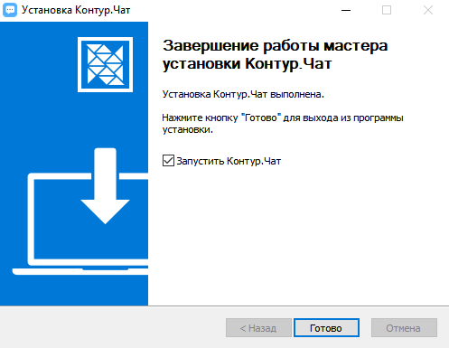
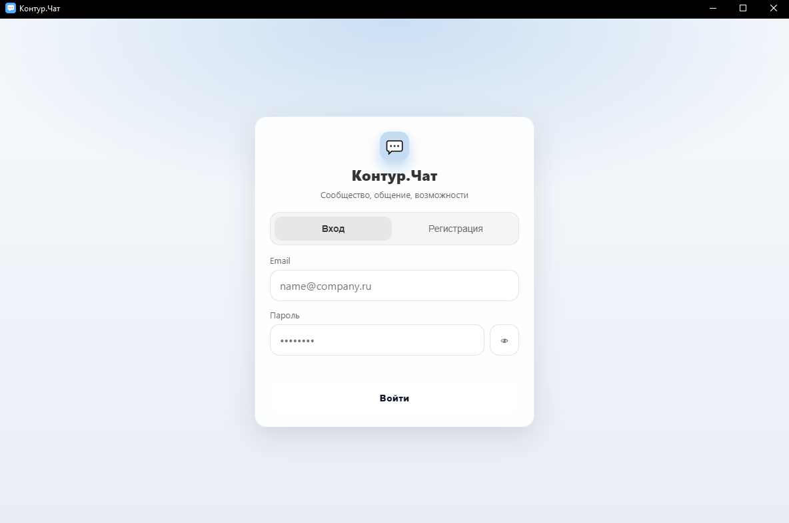
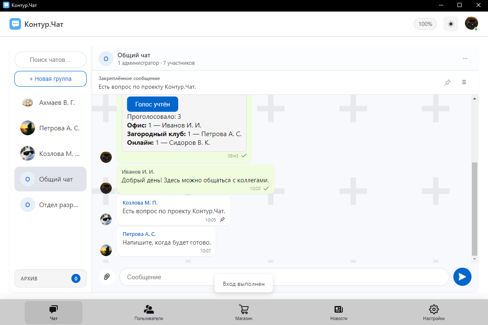
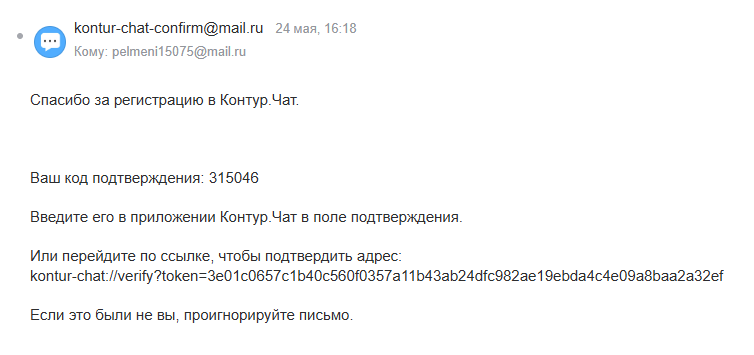
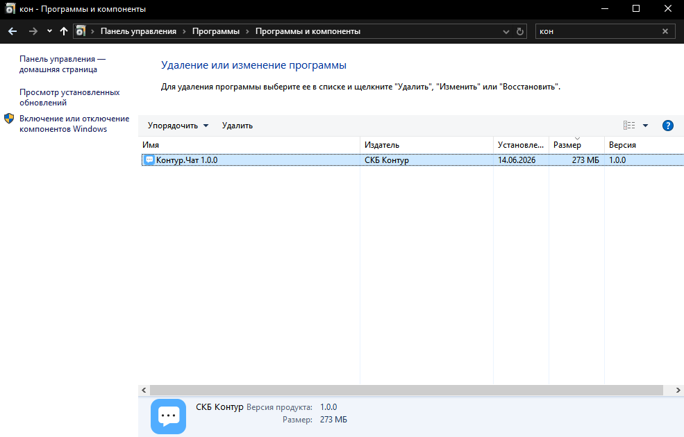
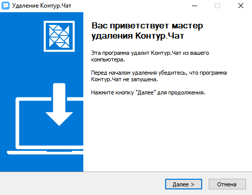
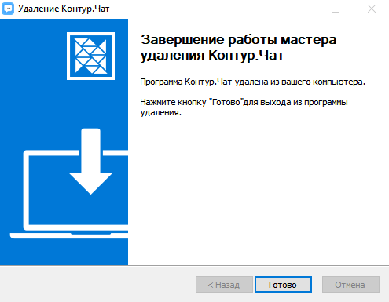

# Установщик мессенджера Контур.Чат

Руководство для пользователей и администраторов по установке десктопного мессенджера **Контур.Чат** на Windows.

## О приложении

**Контур.Чат** — десктопный мессенджер для Windows (СКБ Контур): чаты, пользователи, новости, магазин сообщества. Приложение собрано на Electron и устанавливается через NSIS-установщик.

Текущая версия: **1.0.0**.


## Системные требования

| Параметр | Требование |
|----------|------------|
| ОС | Windows 10 или новее (64-bit) |
| Права | Установка «для текущего пользователя» — **без прав администратора** |
| Сеть | Интернет для синхронизации сообщений между пользователями и для подтверждения email по SMTP |
| Диск | ~200 МБ под программу

## Установка

### Шаг 1. Запуск установщика

1. Скачайте `KonturChat_setup_1.0.0.exe`.
2. Дважды щёлкните по файлу.
3. Если Windows SmartScreen предупредит о неизвестном издателе — нажмите **«Подробнее»** → **«Выполнить в любом случае»** (приложение без цифровой подписи).



### Шаг 2. Мастер установки

Установщик работает в **пошаговом режиме** (не «в один клик»). На экранах мастера доступны такие действия:

| Экран / опция | Поведение по умолчанию |
|---------------|------------------------|
| Выбор папки установки | Можно изменить; см. [путь по умолчанию](#куда-устанавливается-приложение) |
| Ярлык на рабочем столе | **Создаётся** |
| Ярлык в меню «Пуск» | **Создаётся** (имя: **Контур.Чат**) |
| Запуск после завершения | **Да** — приложение откроется сразу после установки |

  
  


### Шаг 3. Первый запуск

1. Запустите **Контур.Чат** с рабочего стола, из меню «Пуск» или из папки установки.

2. Зарегистрируйте аккаунт или войдите под существующим.

3. Подтвердите email — на указанный адрес придёт письмо с кодом или ссылкой (`kontur-chat://...`).

4. После подтверждения почты станут доступны чаты и остальные разделы.

> **Важно:** для отправки писем подтверждения на стороне организации должен быть настроен SMTP (см. раздел [Настройки для администратора](#настройки-для-администратора)).

---

## Куда устанавливается приложение

### Программа (без изменения настроек установки)

По умолчанию файлы приложения попадают в каталог **текущего пользователя**:

```
%LOCALAPPDATA%\Programs\Контур.Чат\
```

Для типичного профиля Windows это:

```
C:\Users\<ИмяПользователя>\AppData\Local\Programs\Контур.Чат\
```

В этой папке находятся:

- `Контур.Чат.exe` — исполняемый файл;
- библиотеки и ресурсы приложения (в том числе внутри `resources\`);
- дефолтная копия базы данных внутри пакета (используется только при первом запуске для копирования в профиль пользователя).

Установщик **разрешает выбрать другую папку** — на экране «Выбор места установки» можно указать любой путь на диске.

### Данные пользователя (не удаляются при деинсталляции)

Настройки, база данных, вложения и кэш интерфейса хранятся **отдельно** от папки программы:

```
%APPDATA%\Контур.Чат\
```

Обычно:

```
C:\Users\<ИмяПользователя>\AppData\Roaming\Контур.Чат\
```

| Файл / папка | Назначение |
|--------------|------------|
| `network-sync.json` | Адрес сервера синхронизации и служебные данные обмена |
| `smtp.env` | Настройки SMTP для отправки писем (создаётся администратором) |
| `message-attachments\` | Файлы, прикреплённые к сообщениям |
| `Local Storage\` | Локальные настройки интерфейса (тема, уведомления и т.д.) |

При удалении программы через «Программы и компоненты» **эти данные сохраняются** (`deleteAppDataOnUninstall: false`). Чтобы полностью очистить следы приложения, папку `%APPDATA%\Контур.Чат\` нужно удалить вручную.

---

## Настройки в приложении

Откройте раздел **«Настройки»** (иконка шестерёнки в нижнем меню).

### Профиль

| Поле | Описание | Ограничения |
|------|----------|-------------|
| Фото | Загрузка из файла, буфера обмена, редактирование, сброс | Изображение |
| Имя | Отображаемое имя | до 20 символов |
| О себе | Краткое описание | до 70 символов |
| Электронная почта | Для входа и подтверждения | до 254 символов; смена требует подтверждения |
| Город | Выбор из списка российских городов | Один город из списка |
| Баллы | Начисляются за активность в сообществе | Только просмотр |

### Основные

| Настройка | По умолчанию | Описание |
|-----------|--------------|----------|
| **Тёмная тема** | выкл. | Переключение светлой и тёмной темы (также доступно иконкой солнца/луны в шапке) |
| **Отправлять по Enter** | вкл. | Enter — отправить сообщение; Shift+Enter — новая строка. Если выкл. — отправка по **Ctrl+Enter** |
| **Уведомления на рабочем столе** | вкл. | Всплывающие уведомления Windows о новых сообщениях, публикациях и событиях в «Новостях» |

При первом включении уведомлений Windows может запросить разрешение — подтвердите его в системном диалоге.

### Безопасность

- **Смена пароля** — текущий пароль, новый (минимум 6 символов) и подтверждение по коду из письма.
- **Удаление аккаунта** — запрос кода на email, затем подтверждение в приложении. Данные аккаунта удаляются из локальной базы.

### Настройки в чатах (дополнительно)

В параметрах **группового чата** можно:

- менять название и аватар чата;
- просматривать список участников;
- **отключать уведомления** для конкретного чата.

---

## Настройки для администратора

### SMTP — письма подтверждения

Без SMTP регистрация, смена email, смена пароля и удаление аккаунта не смогут отправить письма пользователям.

Создайте файл **`smtp.env`** в каталоге данных приложения:

```
%APPDATA%\Контур.Чат\smtp.env
```

Пример содержимого:

```env
SMTP_HOST=smtp.example.com
SMTP_PORT=465
SMTP_SECURE=true
SMTP_USER=messenger@example.com
SMTP_PASS=пароль-приложения
SMTP_FROM=messenger@example.com
```

Поддерживаются те же переменные с префиксом `KONTUR_` (`KONTUR_SMTP_HOST`, `KONTUR_SMTP_PORT` и т.д.).

После изменения `smtp.env` **перезапустите** Контур.Чат.

## Обновление

1. Скачайте новый `KonturChat_setup_<версия>.exe`.
2. Запустите установщик поверх существующей версии.
3. Папку установки можно оставить прежней — мастер предложит её по умолчанию.
4. Пользовательские данные в `%APPDATA%\Контур.Чат\` при обновлении **сохраняются**.

---

## Удаление

### Через Windows

1. **Параметры** → **Приложения** → **Установленные приложения** (или «Программы и компоненты»).

2. Найдите **Контур.Чат** → **Удалить**.  
  


Либо запустите деинсталлятор из папки установки (файл вида `Uninstall Контур.Чат.exe`).

### Полная очистка

После стандартного удаления программы вручную удалите (при необходимости):

```
%APPDATA%\Контур.Чат\
```

---

## Ярлыки и протокол

| Элемент | Расположение / имя |
|---------|-------------------|
| Рабочий стол | Ярлык **Контур.Чат** |
| Меню «Пуск» | **Контур.Чат** |
| Протокол ссылок | `kontur-chat://` — для подтверждения email из браузера |

Идентификатор приложения в Windows: `ru.skbkontur.chat`.

---

## Решение типичных проблем

| Симптом | Что проверить |
|---------|---------------|
| Письмо подтверждения не приходит | Файл `smtp.env`, доступность SMTP-сервера, папка «Спам» |
| Сообщения не доходят другим пользователям | Интернет, адрес в `network-sync.json`, доступность sync-сервера |
| «Нет соединения с сервером» в статусе синхронизации | URL должен начинаться с `wss://` (или `ws://` для локальной отладки) |
| Ошибка при запуске после копирования БД | Путь в `KONTUR_CHAT_DB` должен быть доступен на запись |
| Уведомления не показываются | Включите в настройках приложения и в **Параметрах Windows → Система → Уведомления** для Контур.Чат |

---

## Краткая шпаргалка путей

| Что | Путь по умолчанию |
|-----|-------------------|
| Программа | `%LOCALAPPDATA%\Programs\Контур.Чат\` |
| Данные пользователя | `%APPDATA%\Контур.Чат\` |
| База данных | `%APPDATA%\Контур.Чат\kontur-chat.sqlite` |
| Вложения | `%APPDATA%\Контур.Чат\message-attachments\` |
| SMTP (админ) | `%APPDATA%\Контур.Чат\smtp.env` |
| Синхронизация | `%APPDATA%\Контур.Чат\network-sync.json` |
| Установщик | `KonturChat_setup_1.0.0.exe` |

---

*СКБ Контур · Контур.Чат · версия 1.0.0*
